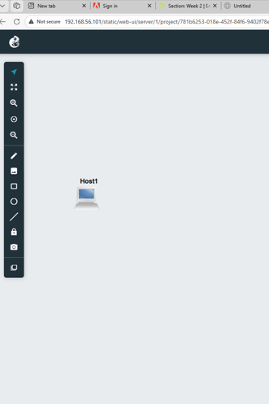
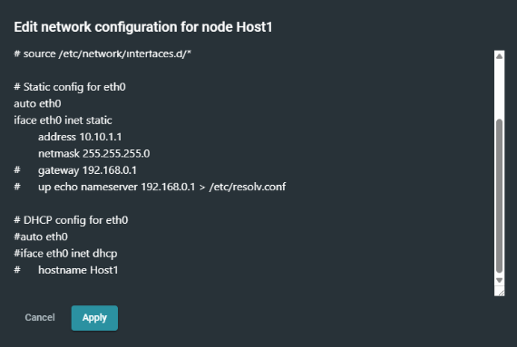
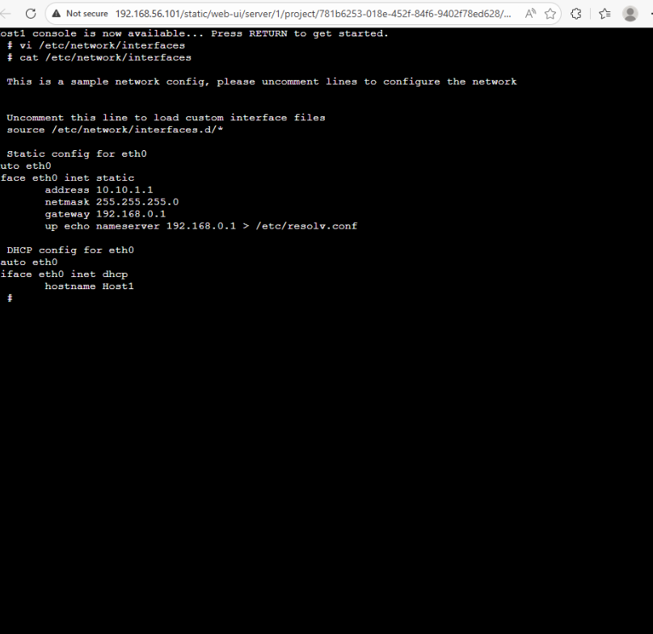

##WEEK 1
## Project Overview
Project demonstrates a basic TCP/IP network setup using GNS3.

## Objective
- TCP/IP configuration
- GNS3 project
- Configure host network
- static IP addressing

## Tools
- GNS3
- GNS3 Web Interface
- GitHub

## Network 
- IP Address: 10.10.1.1
- Subnet Mask: 255.255.255.0
- Gateway: 192.168.0.1


## Configuration Code
```bash
auto eth0
iface eth0 inet static
    address 10.10.1.1
    netmask 255.255.255.0
#   gateway 192.168.0.1
    up echo nameserver 192.168.0.1 > /etc/resolv.conf

```
## Screenshots


### Topology View


### Host Configuration


### Console Output

