## Project Overview- Week 2
This project demonstrates a TCP/IP network setup using GNS3 with multiple hosts connected through a switch. Each host is configured with a static IP address and tested using ping commands.

---

## Network Topology
- 4 Hosts (Host1, Host2, Host3, Host4)
- 1 Switch
- Star topology connection

---

## IP Configuration

| Host  | IP Address |
|------|-----------|
| Host1 | 10.10.2.1 |
| Host2 | 10.10.2.2 |
| Host3 | 10.10.2.3 |
| Host4 | 10.10.2.4 |

Subnet Mask: 255.255.255.0

---

## Configuration Code

```bash
auto eth0
iface eth0 inet static
    address 10.10.2.X
    netmask 255.255.255.0
    up echo nameserver 192.168.0.1 > /etc/resolv.conf
```

---

## Screenshots

### Topology
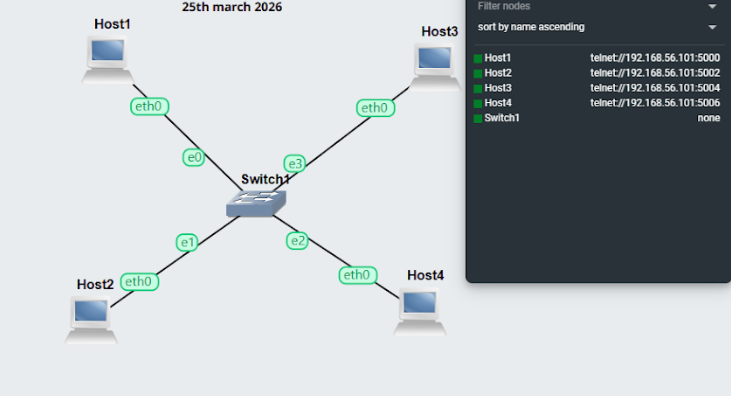

### Host 1 Configuration
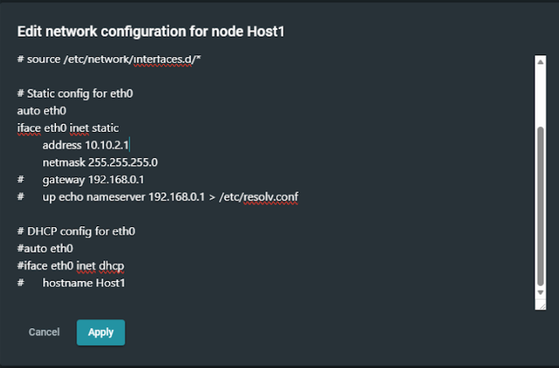

### Host 2 Configuration
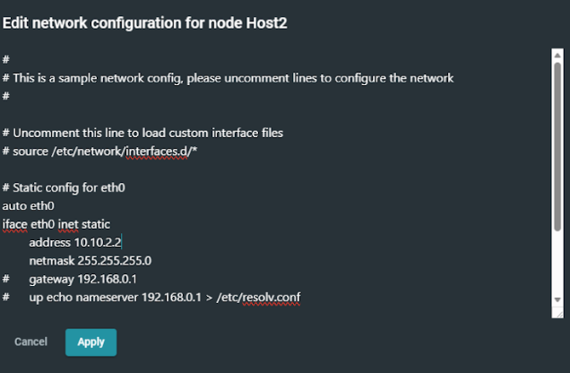

### IP Address Host1
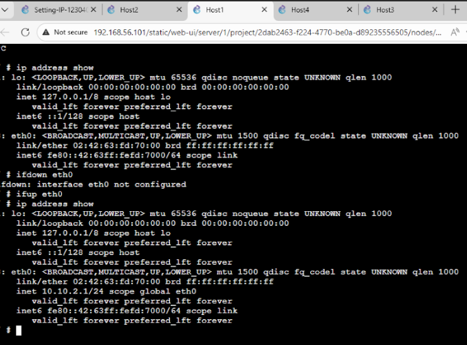

### IP Address Host2
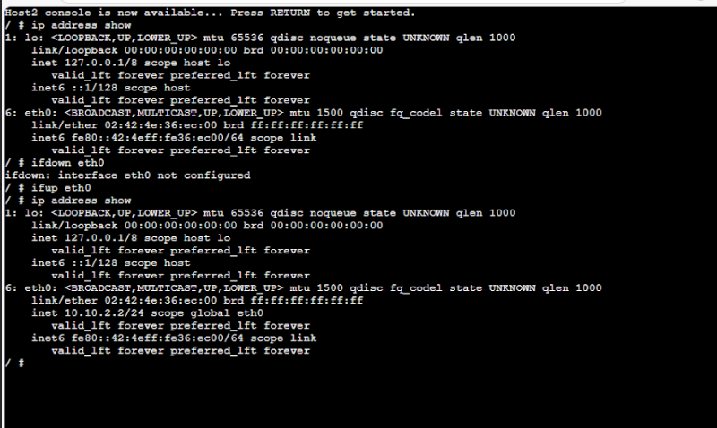

### IP Address Host3
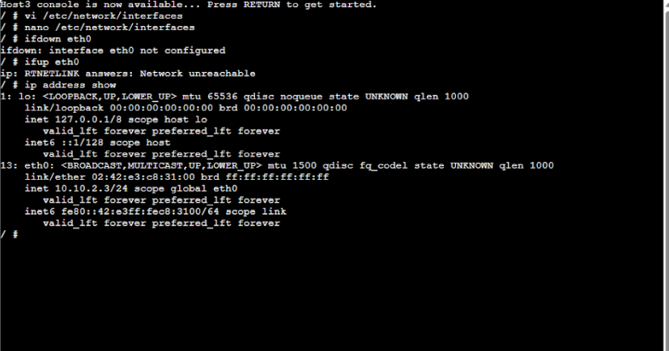


### Console Host3
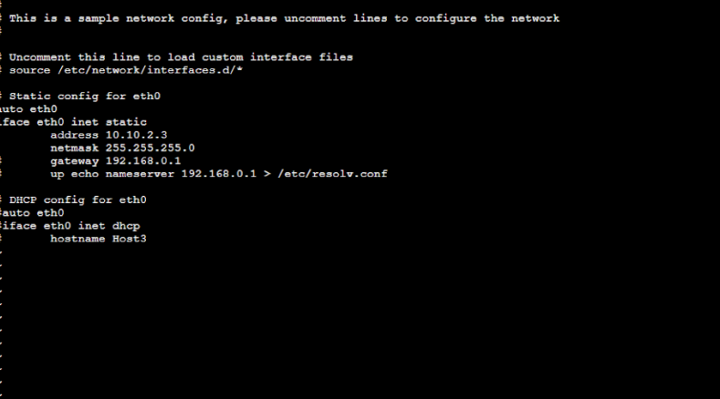

### Console Host4
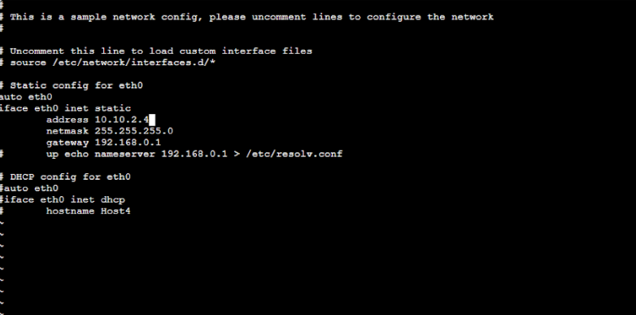

### Ping Test (Success Host1 to Host2)
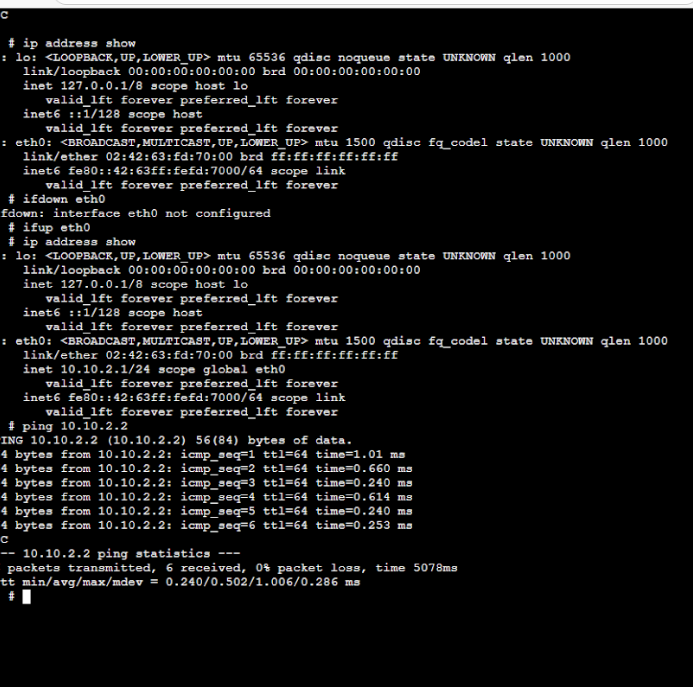

### Ping Test (Success Host4 to Host2)
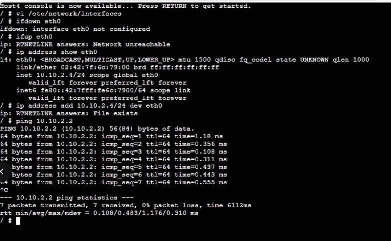

### Ping Test (Failure)
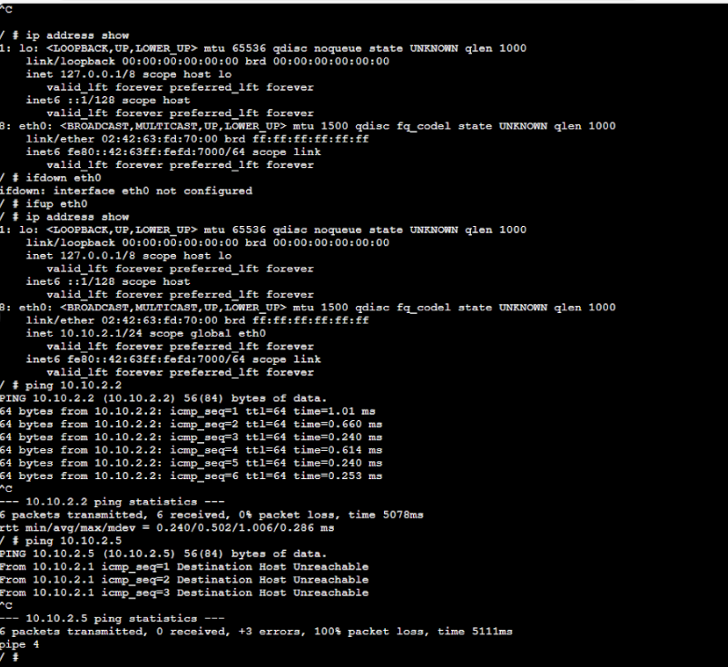

