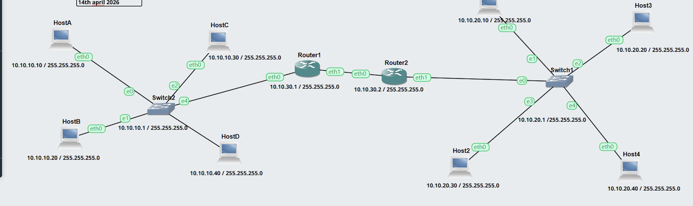
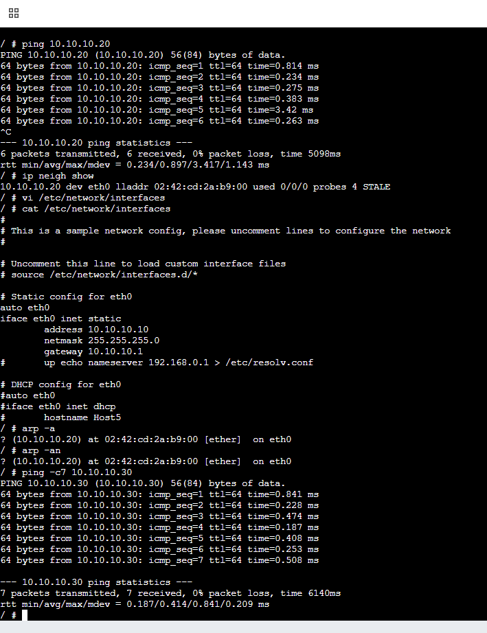
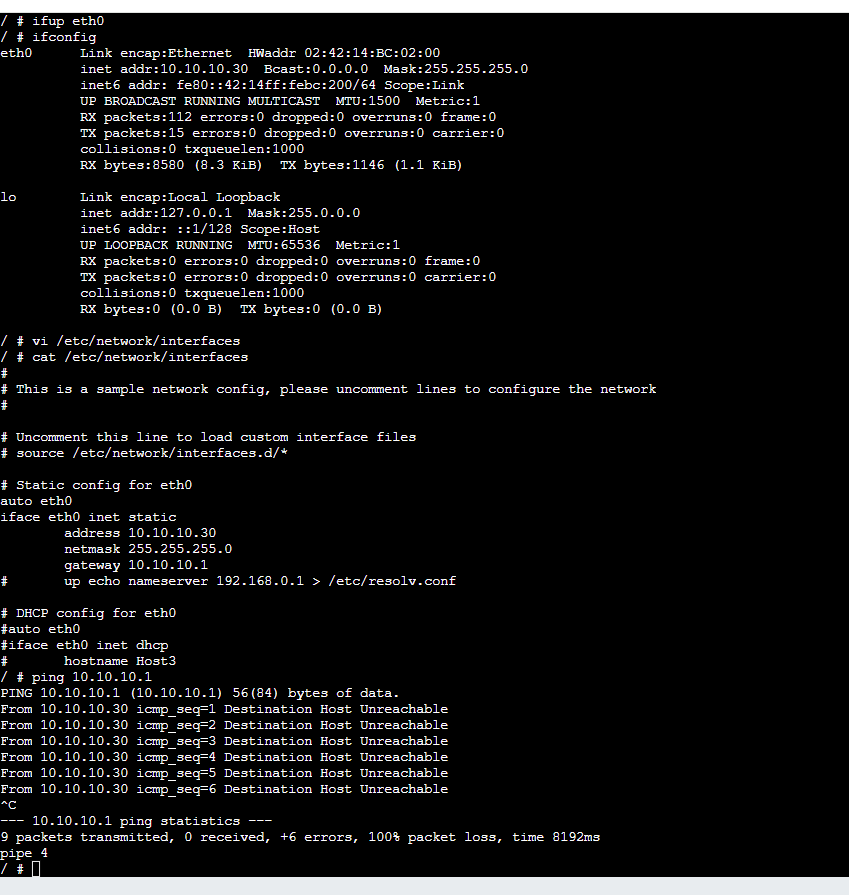
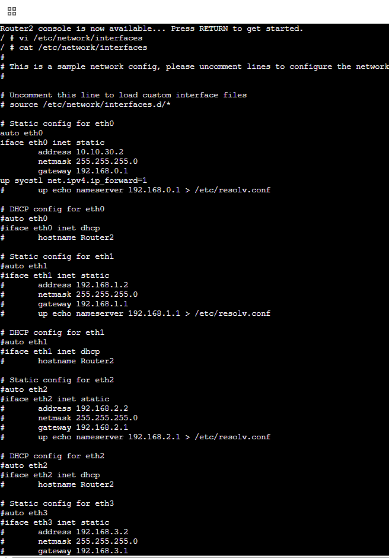

# Week 6 – Address Resolution and Management
 

week focused on ARP and basic address resolution in a routed network. 
---
 
## Topology

 
topology shown 2 LANs connected through two routers, where left hand side contains HostA to HostD and the right hand side contains Host1 to Host4.
 
---
 
## Left LAN Host Configurations
 
### HostA

 
It was configured with a static IP address in the 10.10.10.0/24 network and  Router1 as the default gateway.
 
### HostB

 
It was configured in the same subnet as HostA with a different host address.
 
### HostC

 
It was configured with a static IP in the same left side network and used the same gateway.
 
### HostD

 
In HOST D, it  was also configured in the 10.10.10.0/24 subnet.
 
---
 
## Right LAN Host Configurations
 
### Host1:configured in the 10.10.20.0/24 network.

 

 
### Host2: configured with a static IP in the same subnet as Host1.

 

 
### Host3 :configured in the right-side LAN and used Router2 as the default gateway.

 

 
### Host4 : also configured in the same subnet and checked using interface commands

 

 
---
 
## Router Configuration
 
### Router1

 
It connects the left LAN to the inter-router network, where IP forwarding was enabled so packets could move between networks.
 

 
screenshot shows interface checking after configuration.
 
### Router2

 
connects the inter-router network to the right LAN. IP forwarding was also enabled here.
 

 
screenshot shows the active interface details after setup.
 
---
 
## Verification
 

 The screenshots display interface inspections by the use of 'ifconfig', connectivity inspections by the use of 'ping', and ARP inspections by the use of 'arp -a' or other similar commands. This coincides with the key concepts of the Week 6 lecture, where ARP is employed to translate IP addresses to MAC addresses within a local network prior to the frame delivery: :contentReference[oaicite:1]{index=1}
 
Lecture ARP is applied when a device has the destination IP address but does not have the corresponding MAC address on the LAN. The ARP request is made broadcast and ARP reply is sent back as unicast. :contentReference[oaicite:2]{index=2}
---
 
## Result
It were configured with static IP addresses. And also routers  were set to forward packets. The connectivity tests were used to verify communication. 

